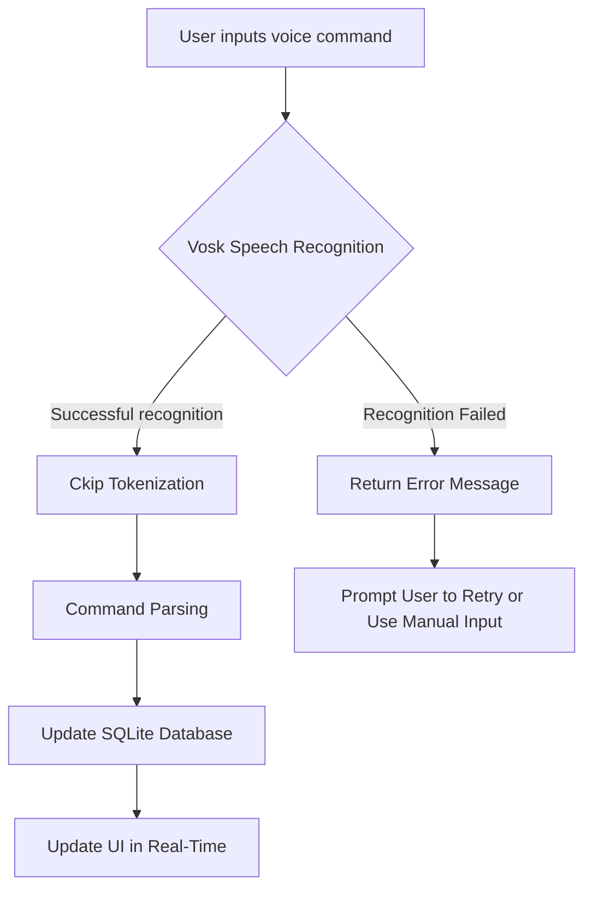

# 🎙️ Voice-Controlled To-Do List

## 📌 Introduction

This project is a voice-controlled To-Do List application based on **PyQt5 + Vosk + SQLite**, designed to manage daily tasks through voice commands for a more convenient and efficient workflow. The application supports both manual and voice input, allowing users to **add tasks, mark them as completed, and delete tasks**. It also supports task categorization and an undo feature.

Beyond providing a convenient task management tool, this project is also a **practical application of Natural Language Processing (NLP) technology**. By leveraging **speech recognition and semantic analysis technologies**, users can interact with the system naturally through voice commands. This makes it an ideal project for developers, researchers, and individuals interested in voice technology and NLP applications.

## 📌 Key Features

- Add, mark as completed, and delete tasks using voice commands
- Store tasks using an SQLite database
- Real-time UI updates synchronized with voice input
- Undo mechanism to prevent accidental operations
- Manual operation mode, allowing task management via mouse
- Integration of NLP tokenization and semantic analysis to enhance voice command accuracy

## 📌 File Structure and Workflow

This application consists of **a speech recognition module, a task management module, and a graphical user interface (GUI)**.

```
.
│
├── app_v0.9.4.py  # Main script, handling speech processing and GUI interactions
├── v_todo_ui.py    # GUI interface generated by Qt Designer
└── todo.db         # SQLite database storing tasks (created after execution)
```

Workflow diagram:



## 📌 Environment Setup and Usage

### 1. Install Required Dependencies

### Download the Latest Vosk Chinese Model

This application uses **vosk-model-small-cn-0.22** for speech recognition. Ensure you have downloaded and extracted the latest Vosk Chinese model.

Run the following commands to download and extract the model:

```bash
wget https://alphacephei.com/vosk/models/vosk-model-small-cn-0.22.zip
unzip vosk-model-small-cn-0.22.zip
```

To check for the latest available models, visit the official website: [Vosk Models](https://alphacephei.com/vosk/models).

Ensure **Python 3.8 or later** is installed, then execute the following command to install required packages:

```bash
pip install -r requirements.txt
```

`requirements.txt` includes the following key dependencies:

- **PyQt5** (GUI interface)
- **Vosk** (Speech recognition)
- **Ckip-Transformers** (Chinese NLP processing)
- **SQLite3** (Local database management)

### 2. Launch the Application

In the project directory, run the following command:

```bash
python app_v0.9.4.py
```

Once launched, the GUI will appear, allowing users to choose **manual operation** or **voice control**.

### 3. Voice Command Usage

| Voice Command       | Function               |
|---------------------|-----------------------|
| "Add task buy milk" | Adds "buy milk" to the task list |
| "Complete buy milk" | Marks "buy milk" as completed |
| "Delete buy milk"   | Deletes "buy milk" from the task list |
| "Undo"             | Reverts the last action |

**Notes:**

- Voice commands are transcribed by **Vosk** and analyzed by **Ckip-Transformers** for semantic parsing.
- If a command is not recognized, the application will prompt the user to retry.

## 📌 Technical Details

This project uses **PyQt5** for GUI development, integrates **Vosk** for speech recognition, and employs **Ckip-Transformers** for analyzing the meaning of voice inputs.

### 🎙️ Speech Recognition

- **Vosk** runs locally, requiring no internet connection.
- Converts spoken input into text, which is then further processed.

### 🔍 Semantic Analysis

- **Ckip-Transformers** is a Chinese NLP tool developed by Academia Sinica, specializing in tokenization, part-of-speech tagging, and semantic analysis. This technology ensures accurate interpretation of voice commands.
- Example: "Add task buy milk" → `Action: Add, Item: Buy Milk`, enhancing the precision of voice control.
- **cn2an** (Chinese Number to Arabic Number) converts Chinese numbers into Arabic numerals, improving numerical recognition. It supports integers, decimals, percentages, and various numerical formats, helping users quickly grasp numerical information.

### 💾 Task Management

- **SQLite** manages task storage, allowing queries, modifications, and deletions.
- **PyQt Signal-Slot Mechanism** ensures real-time UI updates.

## 📌 Version Information

### v0.9.4

- Basic speech recognition functionality completed
- Integrated SQLite as the database
- UI synchronized with voice commands

## 🎯 Future Enhancements

- **Voice command optimization** (improving NLP accuracy)
- **Cross-device synchronization** (cloud-based task storage)
- **Mobile App Development** (planned for Android/iOS to enhance accessibility)
- **Multi-language Support** (experimenting with NLP processing for different languages to improve system adaptability)

## 🎥 Demo

👉 [**v0.9.4 Demo**](#) (To be added)