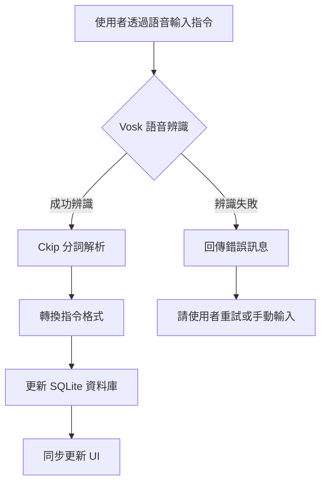

# 🎙️ 語音控制待辦清單

## 📌 簡介

本專案是一款基於 **PyQt5 + Vosk + SQLite** 的語音控制待辦清單（To-Do List）應用，旨在透過語音指令來管理日常待辦事項，提供更便利的操作方式。應用支援手動與語音輸入，可執行 **新增待辦、標記完成、刪除事項** 等功能，並可支援分類管理與回退功能。

該應用不僅提供便利的待辦管理，更是一次 **自然語言處理（NLP）技術的實戰應用**，利用 **語音辨識與語意分析技術**，讓使用者能夠透過語音與系統自然互動。這對於希望學習 NLP 應用的開發者、研究人員，或是對語音技術有興趣的使用者來說，是一個理想的實作案例。

## 📌 主要功能

- 透過語音指令新增、標記完成、刪除待辦事項
- 支援 SQLite 資料庫，儲存待辦清單
- 提供即時 UI 更新，與語音操作同步顯示
- 語音指令錯誤時，具備回退機制，避免錯誤操作
- 具備手動操作模式，可用滑鼠管理待辦事項
- 整合 NLP 分詞與語意分析技術，提升語音識別與指令理解的準確性

## 📌 檔案結構及流程概念

此應用主要由 **語音辨識模組、待辦事項管理模組、使用者介面（GUI）** 三大部分組成。

```
.
│
├── app_v0.9.4.py  # 主程式，負責語音處理與 GUI 互動
├── v_todo_ui.py    # 由 Qt Designer 產生的 GUI 介面
└── todo.db         # SQLite 資料庫，存放待辦事項（運作後生成）
```

運作流程圖：



## 📌 環境設定及操作流程

### 1. 安裝必要環境

### 下載最新 Vosk 中文模型

本應用使用 **vosk-model-small-cn-0.22** 進行語音辨識，請確保已下載並解壓縮最新的 Vosk 中文模型。

執行以下指令來下載與解壓縮模型：

```bash
wget https://alphacephei.com/vosk/models/vosk-model-small-cn-0.22.zip
unzip vosk-model-small-cn-0.22.zip
```

如果需要查看 Vosk 提供的最新模型，請至官方網站：[Vosk Models](https://alphacephei.com/vosk/models) 確認最新版本。

請確保已安裝 **Python 3.8 以上版本**，並執行以下指令安裝所需套件：

```bash
pip install -r requirements.txt
```

`requirements.txt` 內包含以下主要套件：

- **PyQt5**（GUI 界面）
- **Vosk**（語音辨識）
- **Ckip-Transformers**（中文語意分析）
- **SQLite3**（本地資料庫管理）

### 2. 啟動應用

在專案目錄下，執行以下指令：

```bash
python app_v0.9.4.py
```

應用啟動後，將出現 GUI 介面，可選擇 **手動操作** 或 **語音控制**。

### 3. 語音操作方式

| 語音指令       | 功能           |
| ---------- | ------------ |
| "新增待辦 買牛奶" | 新增「買牛奶」到待辦清單 |
| "完成 買牛奶"   | 標記「買牛奶」為完成   |
| "刪除 買牛奶"   | 刪除「買牛奶」待辦事項  |
| "撤銷"       | 取消上一步操作      |

**備註**：

- 語音指令將透過 **Vosk** 轉換為文字，並交由 **Ckip-Transformers** 進行語意解析。
- 如果指令有誤，應用會提示使用者重試。

## 📌 工作方法及技術細節

本專案採用 **PyQt5** 進行 GUI 開發，結合 **Vosk** 進行語音辨識，並使用 **Ckip-Transformers** 解析語音輸入的語意。

### 🎙️ 語音辨識

- **Vosk** 模型可在本地運行，無需連接網路。
- 輸入語音後，會轉換成文字，並進一步進行分詞解析。

### 🔍 語意分析

- 透過 **Ckip-Transformers** 解析語音輸入的語意。Ckip-Transformers 是由台灣中央研究院開發的中文自然語言處理（NLP）工具，專注於繁體中文的詞性標註、分詞與語意分析。本專案利用該技術來精準識別語音輸入的語意，使指令理解更加自然與準確。例如：「新增待辦 買牛奶」經過 Ckip-Transformers 解析後，可拆解為 `動作: 新增, 項目: 買牛奶`，進一步提升語音控制的準確性與可靠度。
- 例如：「新增待辦 買牛奶」→ `動作: 新增, 項目: 買牛奶`。
- **cn2an** 套件可將「三個」轉換為「3」，提高數據解析準確度。cn2an（Chinese Number to Arabic Number）是一款專門用於將中文數字轉換為阿拉伯數字的 Python 套件，可處理簡體與繁體中文數字的轉換，並適用於各種數值格式（如整數、小數、百分比等）。在本專案中，**cn2an** 幫助將語音輸入中的中文數字自動轉換為可供系統識別的數值格式，讓使用者更快速掌握與數字相關的資訊。

### 💾 待辦事項管理

- **SQLite** 負責儲存待辦事項，應用可查詢、修改、刪除資料。
- 透過 **PyQt Signal-Slot** 進行 UI 即時更新。

## 📌 版本資訊

### v0.9.4

- 完成基本語音辨識功能
- 整合 SQLite 作為資料庫
- 具備 UI 操作與語音指令同步更新

## 🎯 未來考慮精進功能

- **語音指令優化**（提高 NLP 準確度）
- **跨裝置同步**（透過雲端存儲待辦事項）
- **行動版應用開發**（計畫開發適用於 Android/iOS 的行動應用，以提升可用性與便利性）
- **支援英文版本**（未來計畫嘗試不同語言的 NLP 處理，以提升系統的語言適應能力）

## 🎥 Demo

👉 [**v0.9.4 Demo**](#)（待補充）

